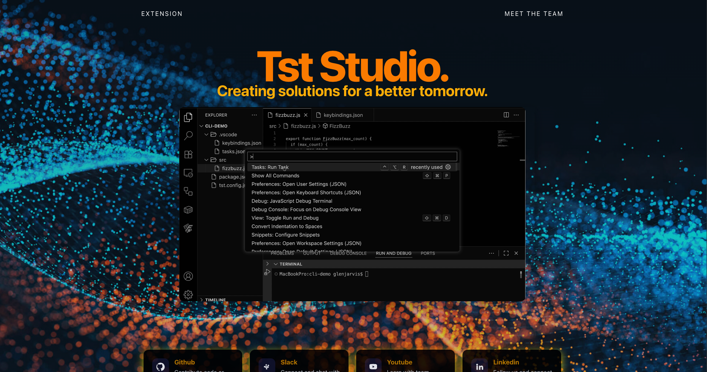

<div align="center">

<h1>Tst Studio. Website</h1>

  <!-- Badges -->
<p>
  <a href="https://github.com/TST-Studio/TestScriptWeb/graphs/contributors">
    
  </a>
  <a href="https://github.com/TST-Studio/TestScriptWeb/commits/main">
    
  </a>
  <a href="https://github.com/TST-Studio/TestScriptWeb/network/members">
    
  </a>
  <a href="https://github.com/TST-Studio/TestScriptWeb/stargazers">
    
  </a>
  <a href="https://github.com/TST-Studio/TestScriptWeb/issues">
    
  </a>
  <a href="https://github.com/TST-Studio/TestScriptWeb/blob/main/LICENSE">
    
  </a>
</p>

</div>

<br />

<p align="center">
  This README provides an overview of the Tst Studio Website project — including setup, tech stack, and guidelines for contributing.
</p>

<!-- About the Project -->

## About the Project

**Tst Studio Website** is the official web interface for **TestScript**, an LLM-powered unit test generator CLI.
It provides a clean and modern frontend to showcase the CLI, its features, and documentation in a developer-friendly way.

 

<br />

**The site is designed as both a landing page and interactive hub:**

- Introduces the TestScript tool and its purpose

- Documents supported AI providers (currently `openai`)  
- Documents supported testing frameworks (currently `vitest`)  

- Guides developers through installation, setup, and usage examples

- Offers a polished, React-based UI for easy navigation
<!-- Getting Started -->

## Getting Started

### Prerequisites

Ensure you have the following installed :

- [Node.js v18+](https://nodejs.org/)
- [npm](https://www.npmjs.com/)
- [Git](https://git-scm.com/)

### Tech Stack

This project is built with :

- [React](https://react.dev/) – Frontend library
- [React Router 7](https://reactrouter.com/) – Client-side routing
- [Vite](https://vitejs.dev/) – Development server & bundler
- [TypeScript](https://www.typescriptlang.org/) – Type safety
- [ESLint](https://eslint.org/) – Linting

### Clone this repository

```bash
git clone git@github.com:TST-Studio/TestScriptWeb.git

cd TestScriptWeb/TestScriptWebPage

```

<!-- Installation -->

### Install dependencies

```bash
  npm install
```

<!-- Run the App -->

### Run the Dev Server

```bash
  npm run dev
```

## Contributing

Contributions are welcome and appreciated!

To contribute:
1. Fork the repository.
2. Create a feature branch.
3. Make your changes.
4. Run and test as needed.
5. Open a pull request.
 

<!-- License -->

## License

This project is licensed under the [MIT License](./LICENSE).
